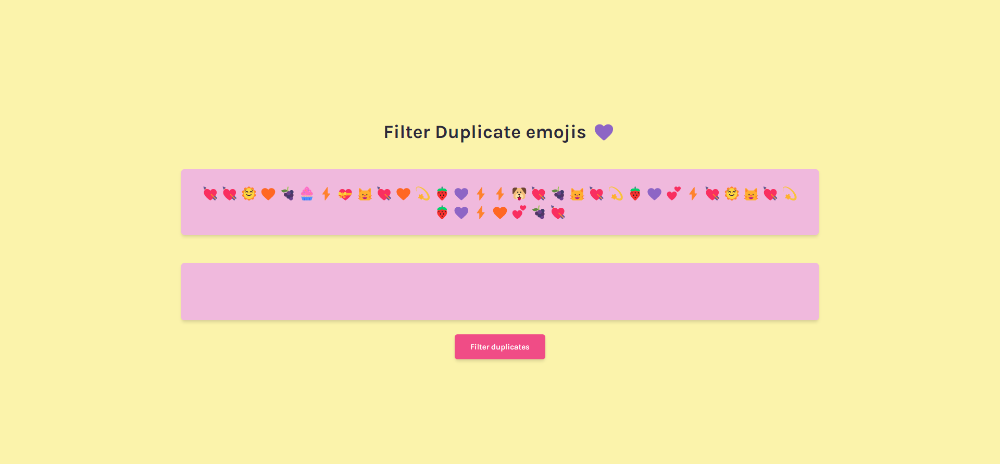
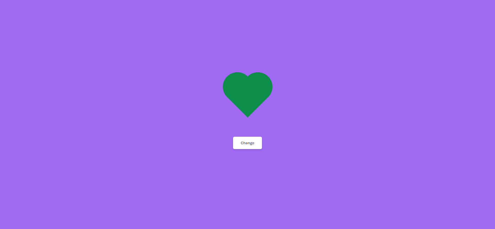
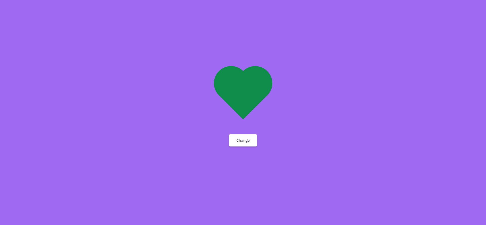
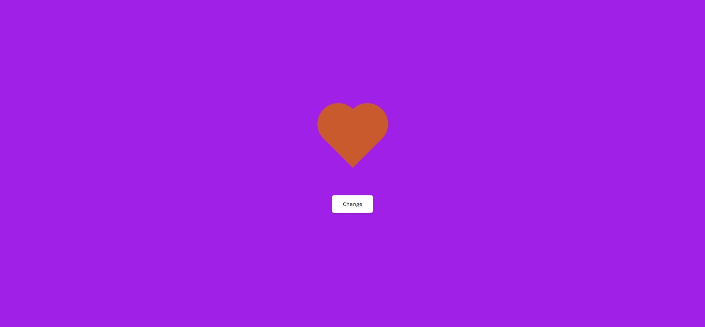

# Frontend Mentor - Profile card component solution

This is a solution to the [Valentine's Challenge](https://scrimba.com/learn/codeweeks/-filter-duplicate-emojis-challenge-co9e84683a1a75f69bfa6a49d). 

## Table of contents

- [Overview](#overview)
  - [Screenshot](#screenshot)
  - [Links](#links)
- [My process](#my-process)
  - [Built with](#built-with)
  - [What I learned](#what-i-learned)
  - [Continued development](#continued-development)
  - [Useful resources](#useful-resources)
- [Author](#author)
- [Acknowledgments](#acknowledgments)

## Overview

This is my solution to the Valentine's Challenge for the 17th of January, 2022.
It is a small project that interacts with the users that displays a list of
emojis and the programs has to filter out the duplicates. I wanted to try new
things, so I added many mouse events and combination of those to get the desired
results. the project is about 70% done, I wanted to add more functionality but
overall I am very impressed on what is possible so far.

### Screenshot






### Links

- Solution URL: [GitHub](https://github.com/newbpydev/valentines-17-2022)
- Live Site URL: [Live Site](https://upbeat-kilby-3fd751.netlify.app/)

## My process

### Built with

- Semantic HTML5 markup
- CSS custom properties
- Flexbox
- Javasript

### What I learned

I have learned on this project how to use the mouseover, mouseenter, and more on
the keyup, keydown events.

```javascript
function topPUpdate() {
  emojiSpanEls.forEach((emojiSpanEl, i) => {
    emojiSpanEl.addEventListener("mouseover", (eInner) => {
      //! If shift is active
      document.addEventListener("keydown", (e) => {
        if (e.shiftKey) {
          emojiSpanEls.forEach((emoji) => {
            if (emojiSpanEl.textContent === emoji.textContent) {
              emoji.classList.add("emoji-span--shifted");
            } else {
              emoji.classList.remove("emoji-span--shifted");
            }
          });
        }
      });

      //! If shift is not active
      document.addEventListener("keyup", (e) => {
        emojiSpanEls.forEach((emoji) => {
          emoji.classList.remove("emoji-span--shifted");
        });
      });
    });
```

### Continued development

For future development, I will continue to use expore the js Dom to manipulate
the elements on my pages, I see that there is so much to learn, but I will
always try new things on every project.

### Useful resources

- [MDN - mouseover event](https://developer.mozilla.org/en-US/docs/Web/API/Element/mouseover_event) - The mouseover event is fired at an Element when a pointing device (such as a mouse or trackpad) is used to move the cursor onto the element or one of its child elements.
- [MDN - NodeList](https://developer.mozilla.org/en-US/docs/Web/API/NodeList) - NodeList objects are collections of nodes, usually returned by properties such as Node.childNodes and methods such as document.querySelectorAll().
- [MDN - EventTarget.removeEventListener()](https://developer.mozilla.org/es/docs/Web/API/EventTarget/removeEventListener) - The removeEventListener() method of the EventTarget interface removes an event listener previously registered with EventTarget.addEventListener() from the target.

## Author

- Website - [Juan Gomez](https://www.newbpydev.com)
- Frontend Mentor - [@newbpydev](https://www.frontendmentor.io/profile/newbpydev)
- Twitter - [@Newb_PyDev](https://twitter.com/Newb_PyDev)

## Acknowledgments

The code may not be perfect compared to my sensei @jonasschmedtman but I need
to thank him because he has shown me the ropes and now I am a confident web
designer.


